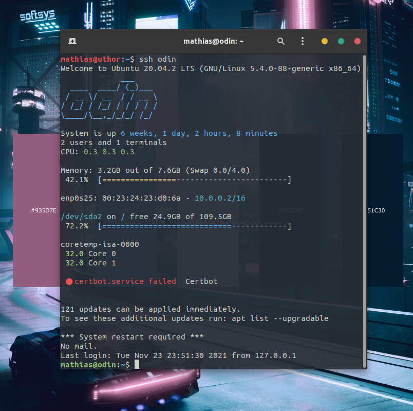

# Server MOTD

This is a custom motd generator, made for keeping an eye on important metrics of your remote server.

**Only tested on Ubuntu Server**

Run `install` as sudo, to install the modules and turn off default timers and services.

`python3`, `figlet` and `lm-sensors` are required. The script will attempt to install them with **apt** during installation.

On most the hardware I tested, these scripts add 100-200ms to the ssh load times.

# modules

## 05-logo

Machine's hostname displayed with `figlet`.

## 10-uptime

- System uptime,
- logged in users and tmux terminals,
- CPU avg loads.
- Memory and swap usage
- Network Cards, MAC and IP

## 18-mounts

Physicall, mounted drives. Device name and path, free and total space.

## 19-temps

Temperature sensor data from `sensors`.

## 21-services

Lists failed services.
